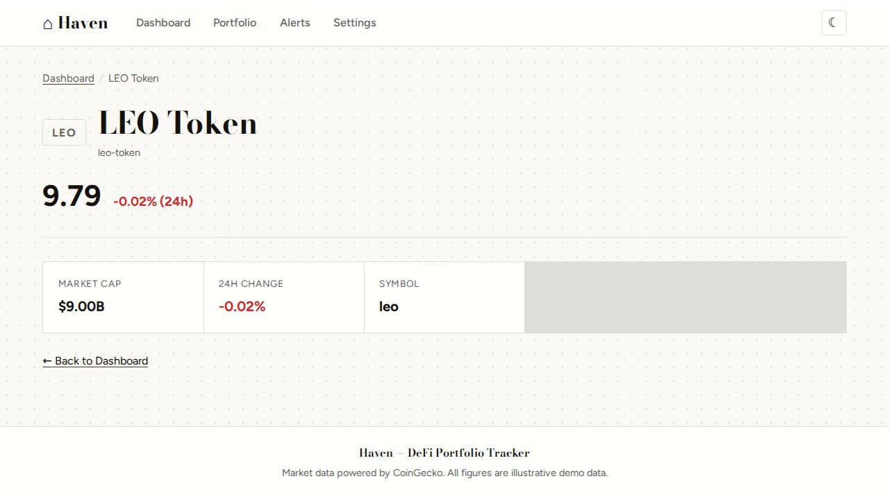
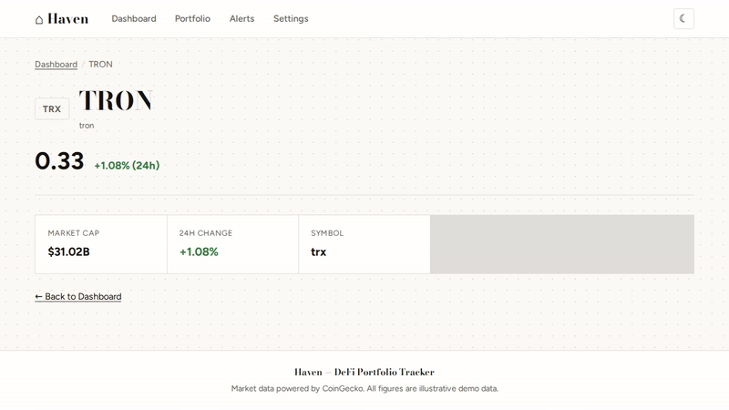
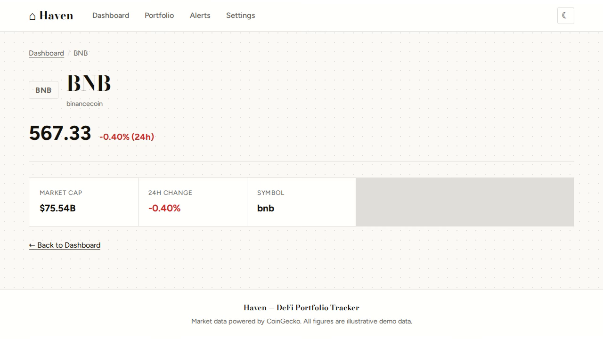
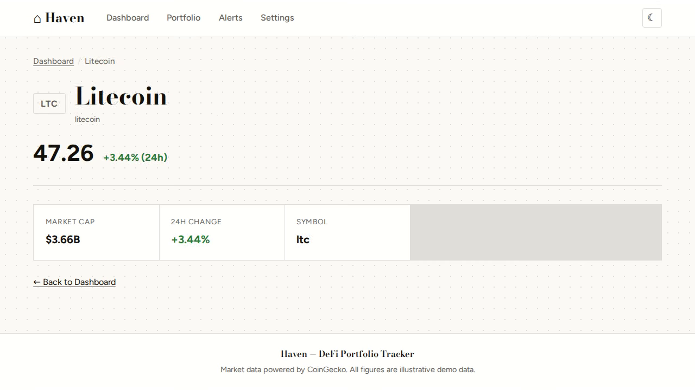
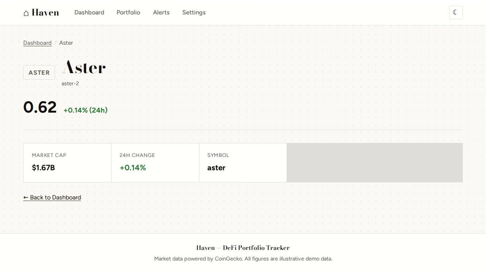

# Haven — complete Go personal finance tracker example app

**Haven** is a free, open-source personal finance tracker built with Go. A DeFi crypto portfolio tracker built with Go (Gin) and server-rendered templates. Run it locally, deploy it as a self-hosted personal finance tracker, or [remix it on cenius.ai](https://cenius.ai/marketplace/p/haven?ref=gh&utm_campaign=haven-golang) to make it your own — the whole application (code, design, seeded demo data) ships in this repository under the MIT license.

[](LICENSE)  [](https://cenius.ai)

[](https://cenius.ai/marketplace/p/haven)

> **▶ [Open & edit in cenius.ai](https://cenius.ai/marketplace/p/haven)** — one click to an editable workspace: describe changes in plain English, get an instant preview, one-click deploy and host. Modifications made on the platform come with full rebrand & relicense rights.

_Local clone? See [Quick start](#quick-start) or [Quickstart](#quickstart) below. cenius.ai is the zero-setup path._

## Demo





▶ **[Watch the full demo video](https://cenius.ai/marketplace/p/haven?ref=gh&utm_campaign=haven-golang)** — the complete walkthrough, playing on the project's cenius.ai page · [MP4 file](.github/media/demo.mp4)

## Screenshots

  

## Features

- Live Crypto Prices
- Portfolio Tracking
- Price Alerts
- In-App Notifications
- Seeded Demo Data
- Responsive Light/Dark UI
- Multiple Screens

## Quick start

```bash
./install.sh   # installs dependencies + seeds demo data
```

See [`INSTALL.md`](INSTALL.md) for full setup and usage instructions.

## Usage guide

### Dashboard (`/`)

The landing page shows a grid of the top 50 cryptocurrencies by market cap, fetched from CoinGecko. Each card displays:

- Symbol chip (e.g. **BTC**)
- 24-hour price change (green for positive, red for negative)
- Coin name
- Current price in USD
- Market cap (abbreviated: B = billions, M = millions)

Click any coin card to view its detail page. Data refreshes on each page load and is cached for 5 minutes.

### Portfolio (`/portfolio`)

Track your cryptocurrency holdings:

- **Summary cards** — Total portfolio value and total P&L
- **Holdings table** — Each position with amount, entry price, current price, current value, and P&L
- **Add holding** — Use the form at the bottom: select a coin, enter amount and entry price
- **Remove holding** — Click the × button on any row (confirmation required)

Holdings are persisted to `data/holdings.json` and survive restarts.

### Price Alerts (`/alerts`)

Set threshold alerts that trigger visually when the market hits your target:

- **Alert list** — Each alert shows the coin, condition (above/below target), current price, and status
- **Status pills**:
  - **Active** — Monitoring; price hasn't crossed the threshold
  - **Triggered** — Price has crossed the threshold (left border turns red)
  - **Inactive** — Alert is disabled
- **Create alert** — Select a coin, choose direction (above/below), set target price
- **Delete alert** — Click × to remove

Alerts are checked on page load against current prices.

### Coin Detail (`/coins/:id`)

View detailed information for any coin:

_Full guide: [`USAGE.md`](USAGE.md)_

## Architecture

Go application, delivered as a complete, runnable project (27 files). Top-level layout: `cache/`, `data/`, `handlers/`, `seed/`, `services/`, `static/`, `store/`, `templates/`. `install.sh` provisions dependencies and seeds demo data, so the app boots with something to show. Setup details live in [`INSTALL.md`](INSTALL.md).

## FAQ

### What does it take to self-host Haven?

`git clone` + `./install.sh` gets you a running instance — the install script provisions dependencies and demo data. Full steps live in [`INSTALL.md`](INSTALL.md); nothing external is needed to try it.

### What powers Haven under the hood?

Haven is a Go application — and this repository holds the complete, runnable source, not a stripped-down sample. Highlights include in-App Notifications.

### Does the Haven license allow commercial use?

It is. MIT licensing means you can build a product on it, sell it, or use it inside a company with no fees. Details: [LICENSE](LICENSE).

### Can I rebrand or white-label Haven?

Yes. You can edit the source directly under the MIT license, or [remix it on cenius.ai](https://cenius.ai/marketplace/p/haven?ref=gh&utm_campaign=haven-golang) — the platform route grants full rebrand and relicense rights over your derivative.

### Is there a no-code way to modify Haven?

Describe what you want changed on [cenius.ai](https://cenius.ai/marketplace/p/haven?ref=gh&utm_campaign=haven-golang) — no code editing needed; the platform produces a fresh build you can download and deploy.

## License & rebranding

Released under the [MIT License](LICENSE) (© 2026 Cenius AI) — free for personal and commercial use.

**Need a customized version?** [Remix this app on cenius.ai](https://cenius.ai/marketplace/p/haven?ref=gh&utm_campaign=haven-golang) — modifications made on the platform come with **full rebrand & relicense rights** over your derivative.

## Built with cenius.ai

This entire application — code, design, seeded demo data — was generated on **[cenius.ai](https://cenius.ai)** from a plain-English description.

- 🚀 [Build your own app on cenius.ai](https://cenius.ai)
- 🎛️ [Remix Haven on the marketplace](https://cenius.ai/marketplace/p/haven?ref=gh&utm_campaign=haven-golang) — open it in a workspace, prompt for changes, and ship your own version.

More open-source apps: [the Cenius-ai catalog](https://github.com/Cenius-ai) · [showcase index](https://github.com/Cenius-ai/showcase)
